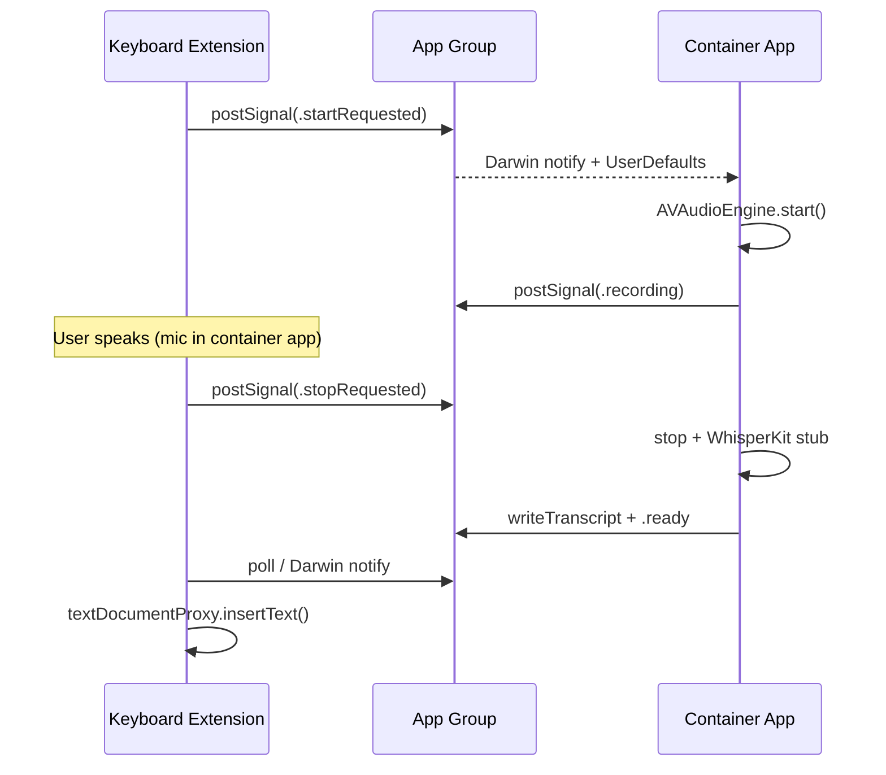

# LocalFlow iOS Spike (Features 17–20)

Simulator-only scaffold for the Local Wispr Flow mobile pattern. **No provisioning, no device ship** — validates the keyboard ↔ container app architecture before Apple Developer org gating clears.

MIT licensed · product name **LocalFlow**

## Hard constraint: keyboard extensions cannot access the microphone

iOS keyboard extensions run in a sandbox that **does not grant microphone access**. This is not a policy choice — it is a platform limitation. Wispr Flow on iOS works around it by splitting responsibilities:

| Component | Role | Mic | STT |
|-----------|------|-----|-----|
| **LocalFlow** (container app) | Owns `AVAudioSession`, `AVAudioEngine`, WhisperKit | ✅ | ✅ |
| **LocalFlowKeyboard** (extension) | UI-only dictation chrome + text insertion | ❌ | ❌ |
| **App Group** (`group.com.cipherholdings.localflow`) | Signal + transcript bridge | — | — |

## Architecture



### UI flow (keyboard)

1. **Globe** — arm dictation flow (distinct from system keyboard switcher on trailing globe)
2. **Mic** — write `startRequested` to App Group; container app begins recording
3. **Speak** — waveform state while container captures audio
4. **Checkmark** — write `stopRequested`, poll for transcript, insert at cursor

### Bridge (`Shared/TranscriptBridge.swift`)

- **UserDefaults** (`suiteName: appGroupID`) — lightweight state machine: `idle → startRequested → recording → stopRequested → transcribing → ready`
- **File** (`last_transcript.json` in App Group container) — transcript payload with session UUID
- **Darwin notifications** — wake the container app without polling-only latency

## Project layout

```
ios-spike/
├── README.md
├── Package.swift                 # optional SPM mirror of Shared module
├── Shared/
│   └── TranscriptBridge.swift
├── LocalFlowApp/
│   ├── LocalFlowApp.swift
│   ├── ContentView.swift         # AVAudioEngine + WhisperKit stub
│   ├── Info.plist
│   └── LocalFlowApp.entitlements
├── LocalFlowKeyboard/
│   ├── KeyboardViewController.swift
│   ├── Info.plist
│   └── LocalFlowKeyboard.entitlements
└── LocalFlow.xcodeproj/
    └── project.pbxproj
```

## Open in Xcode (simulator)

1. Open `LocalFlow.xcodeproj`
2. Select **LocalFlow** scheme → any **iPhone Simulator**
3. Signing: **Automatically manage signing** with your personal team (simulator only; no App Store provisioning required for spike)
4. Enable **App Groups** on both targets if Xcode prompts — group ID must match: `group.com.cipherholdings.localflow`
5. Build & run **LocalFlow** first; grant microphone permission
6. Settings → General → Keyboard → Keyboards → Add **LocalFlow** → enable **Allow Full Access** (required for App Group + open access keyboard)
7. Background LocalFlow, open Notes, switch to LocalFlow keyboard, run globe → mic → speak → checkmark

### CLI build (optional)

```bash
cd projects/cipher-lab/local-flow/ios-spike
xcodebuild -scheme LocalFlow \
  -destination 'platform=iOS Simulator,name=iPhone 16' \
  -configuration Debug build
```

## WhisperKit integration (post-spike)

`WhisperKitTranscriberStub` in `ContentView.swift` stands in for on-device STT. Replace with [WhisperKit](https://github.com/argmaxinc/WhisperKit) SPM dependency on the **container app target only**.

## Gated scope (P5 · features 17–20)

This spike covers the architectural proof for:

- **17** — iOS keyboard extension shell
- **18** — App Group cross-process bridge
- **19** — Container-app mic + local STT path
- **20** — End-to-end speak → insert loop (simulator)

Device TestFlight, push-to-open container app, and production model bundling remain gated on Apple Developer org setup.

## License

MIT — see file headers. Based on the Local Wispr Flow / open-wispr desktop lineage (`projects/cipher-lab/local-flow`).
